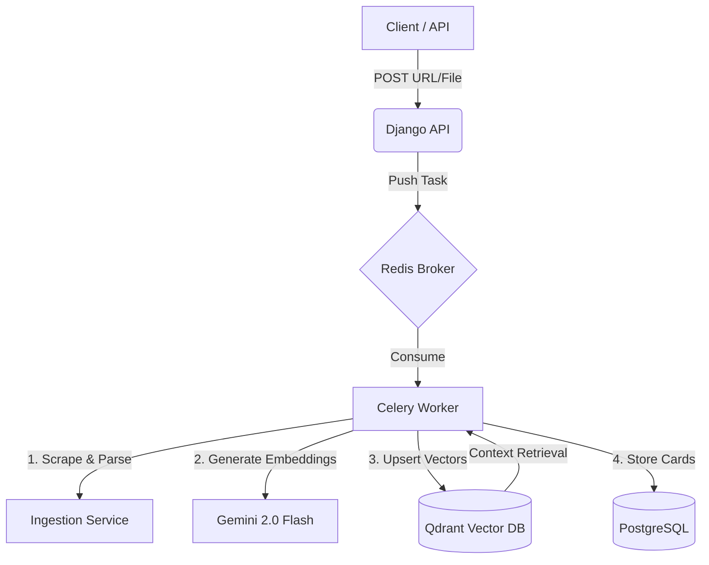

# RecallForge 🧠
### AI-Native Personal Knowledge OS
**Convert any URL, PDF, or YouTube video into spaced-repetition flashcards using RAG and GenAI.**

[](https://www.djangoproject.com/)
[](https://qdrant.tech/)
[](https://docs.celeryq.dev/)
[](https://deepmind.google/technologies/gemini/)
[](https://www.docker.com/)

---

## 🚀 The Elevator Pitch
**RecallForge** addresses information overload by transforming passive content consumption into active knowledge retention. It serves as an intelligent ingestion engine that parses technical documentation, YouTube lectures, and PDFs, converting them into atomic concepts using the **SM-2 Spaced Repetition Algorithm**.

Unlike standard flashcard apps, RecallForge uses **Retrieval-Augmented Generation (RAG)** to ground every AI-generated card in the source material, ensuring high accuracy and context.

---

## 🏗 System Architecture

The system follows an **Event-Driven Architecture** to handle heavy ingestion tasks asynchronously.



### 🧩 Key Components

* **Ingestion Engine:** specialized parsers for YouTube (Transcript API), PDFs (Unstructured), and raw HTML.
* **Vector Pipeline:** Utilizes **Qdrant** for semantic storage, enabling "concept linking" across different decks.
* **Spaced Repetition:** Implements the SuperMemo-2 (SM-2) algorithm to calculate optimal review intervals.
* **Asynchronous Core:** **Celery + Redis** ensures the API remains non-blocking during complex LLM operations.

---

## 🔌 API Reference

**Base URL:** `http://localhost:8000/api/v1/`

| Method | Endpoint | Description |
| --- | --- | --- |
| `POST` | `/ingest/` | **Ingest Content.** Supports YouTube URLs, Web links, or File Uploads. Triggers async Celery task. |
| `GET` | `/review/next/` | **Smart Review.** Fetches the next card due based on SM-2 algorithm. |
| `POST` | `/review/{id}/rate/` | **Submit Rating.** Rate recall (0-5) to update the card's next interval. |
| `GET` | `/cards/` | **List Cards.** Filter by `?deck=ID` or `?tag=Topic`. |
| `POST` | `/auth/users/` | **Register.** Create a new user account (JWT). |

---

## 🛠 Tech Stack

* **Backend:** Python 3.10+, Django 5, Django REST Framework
* **AI & Search:** Google Gemini 2.0 Flash, Qdrant (Vector DB)
* **Async Processing:** Celery, Redis
* **Database:** PostgreSQL
* **Authentication:** Djoser (JWT)
* **DevOps:** Docker, Shell Scripting

---

## ⚡ Quick Start

### Prerequisites

* Docker Desktop (or Colima)
* Python 3.10+

### 1. Installation

```bash
git clone [https://github.com/harshit-singhania/recallforge.git](https://github.com/harshit-singhania/recallforge.git)
cd recallforge
pip install -r requirements.txt

```

### 2. Start Infrastructure

We provide a helper script to spin up Redis, Qdrant, and Postgres containers:

```bash
chmod +x start_infra.sh
./start_infra.sh
# Usage: ./start_infra.sh [stop|restart|status]

```

### 3. Run the Backend

You need two terminal windows to handle the async architecture:

**Terminal 1 (API Server):**

```bash
python manage.py runserver

```

**Terminal 2 (Celery Worker):**

```bash
celery -A config worker -l info

```

---

## ✅ Verification & Testing

To verify the entire RAG pipeline (Ingest -> Embed -> Generate -> Review), run the end-to-end test script:

```bash
python verify_flow.py

```

*This script simulates a full user journey: Creating a secure token, ingesting a YouTube video, waiting for the Celery worker, and performing a mock review.*

**Postman:** Import `recallforge.postman_collection.json` for manual API testing.

---

## 🗺 Roadmap

**v0.1 (MVP) - ✅ Completed**

* [x] URL ingest & Text Extraction
* [x] Auto card generation (Mock LLM)
* [x] Qdrant integration & SM-2 Scheduler

**v0.2 (AI Sprint) - ✅ Completed**

* [x] Integrate Gemini 2.0 Flash
* [x] YouTube Ingestion Pipeline (Transcript Extraction)
* [x] Vision Pipeline (Image Uploads + Gemini Vision)
* [x] PDF/Document Support

**v0.3 (Next Steps)**

* [ ] Next.js Frontend
* [ ] Deck Versioning (Git-style)
* [ ] Mobile App (React Native)

---

## 📄 License

MIT License.
